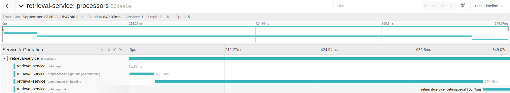
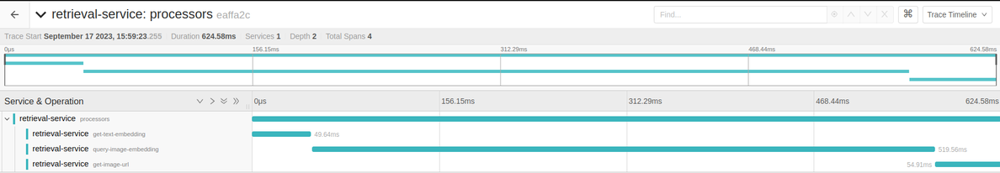
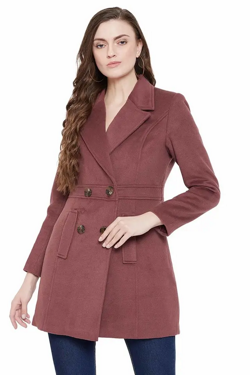

# Build end2end text-image retrieval app

## Local service

### Requirements

```bash
$ pip install git+https://github.com/openai/CLIP.git
$ pin install -r requirements.txt
```

### Model

Fine-tune [CLIP](https://arxiv.org/abs/2103.00020) in image-retrieval task

+  **Input**: Image or text query related to *FASHION*.

+  **Output**: Top images with the highest similarity according to the cosine metrics.

### Database

Using [Pinecone](https://www.pinecone.io/) vector database for fast retrieval result
+ Vector database contains **85577** vector ids, those vectors are images embedding and their metadata.

Using Google Cloud Storage for storing image data

### Local test
```bash
$ docker pull duong05102002/retrieval-local-service:v1.23
$ docker run -p 30000:30000 duong05102002/retrieval-local-service:v1.23
```
Run `client.py` for test the local api.

+ Image query
```bash
$ python client.py --save_dir temp.html --image_query your_image_file
```
+ Text query
```bash
$ python client.py --save_dir temp.html --text_query your_text_query
```
**Note**: Refresh the html page to display the images

### Response time (traces)

+ Image query


+ Text query


**Note**: Refresh the html page to display the images

**Top 8 products images similar with image query:** 



<html>
    <body>
        <div class="image-grid">

        </body>
    </html>


**Top 8 products images similar with text query: crop top** 
<html>
    <body>
        <div class="image-grid">

        </body>
    </html>
    
### CI/CD
`Jenkinsfile` for test CI/CD in local
