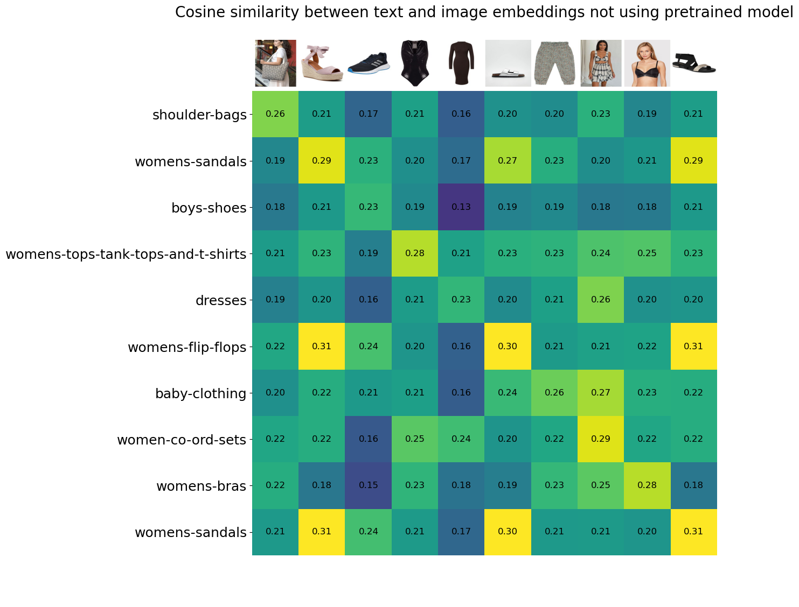
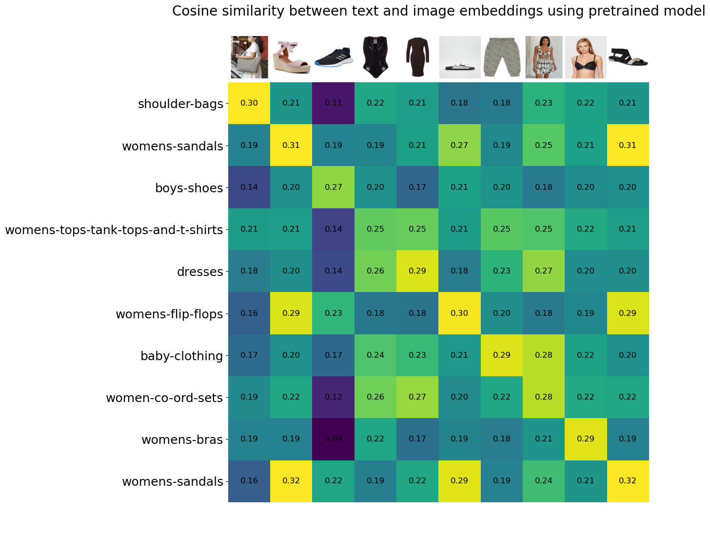

Make directory `model_storage` and `embedding`

+ Download my pretrained model in [here](https://drive.google.com/file/d/1dmqfp-yb8EhzwSjI9pZi6ZAeKjngdtaT/view?usp=sharing) and save in `model_storage`

+ Download entire embedding images in [here](https://drive.google.com/file/d/11nuzqVSNN57EvUCweDl0lFhjmMVmkx52/view?usp=sharing) and save in `embedding`

+ `train.py` for fine-tune [CLIP](https://arxiv.org/abs/2103.00020).
+ `inference.py` for get entire embedding images in [GLAMI-1M small dataset](https://huggingface.co/datasets/glami/glami-1m/resolve/main/GLAMI-1M-dataset--test-only.zip).
+ `insert_vdb.py` for insert embedding images to [Pinecone](https://www.pinecone.io/) vector database.
+ `visualize_similarity.py` for visualize cosine similarity between text and image embeddings between using original and pretrained model.

